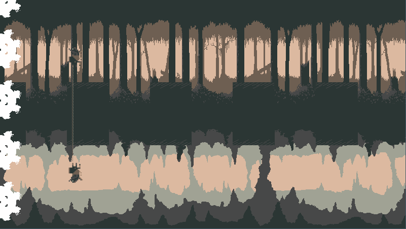

-----------------------------------

-----------------------------------

## Tethered

### Description

Keep running, no matter what. Get to the end.
You are you, but he is also you. I can't promise that it will make sense. 
But I can promise you that you'll make it through, if you cooperate with yourself!

### Features

 - X challenging hand-crafted levels for you to traverse.
 - Run, jump and shoot your way across - with both characters at the same time!

### Controls

Keyboard only:
 - [SPACE] to jump (tap or hold for longer)
 - [CTRL] to fire your gun 
 - [SHIFT] to swap gun between characters

### Screenshots

<video width="630" height="300" src="https://github.com/user-attachments/assets/6e5160ab-29b1-428c-9c33-a506df35c60b"></video>

### Developers

 - Korneel "Tottel" Guns - Code, design, some art, some sounds

### Links

 - YouTube Gameplay: $(YouTube Link)
 - itch.io Release: $(itch.io Game Page)

### License

This project sources are licensed under an unmodified zlib/libpng license, which is an OSI-certified, BSD-like license that allows static linking with closed source software. Check [LICENSE](LICENSE) for further details.

*Copyright (c) 2024 Tottel
